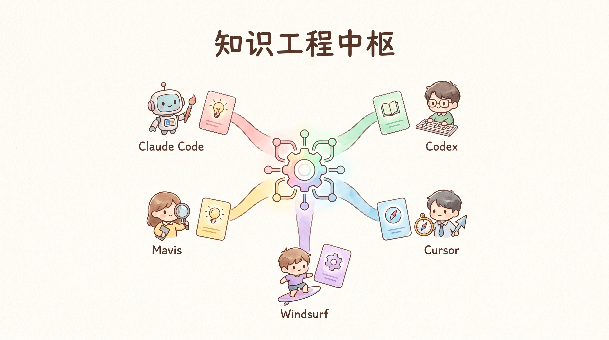
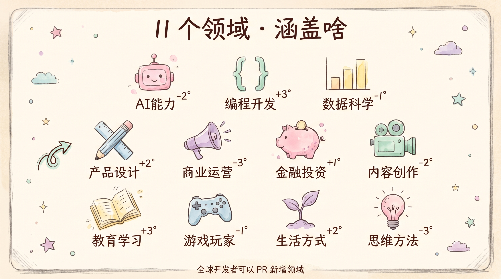
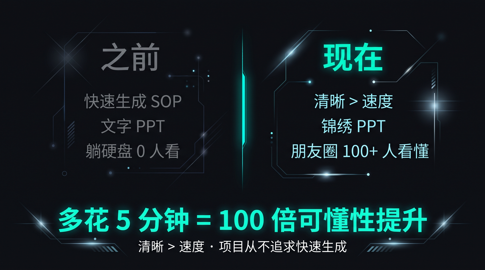

# Pretty Skill · 让技能和知识被人看懂

> ### 💎 大量优秀的 skill 或知识做出来，没人用，因为没人看得懂。
>
> 这个项目就是来解决这个的。**多花 5 分钟讲清楚，比快速生成 100 份强 100 倍**。

> ### ⚠️ 前置条件 · 生图能力是必须的
>
> pretty-skill 所有视觉化都依赖 AI 出图（横屏封面 + 竖屏封面 + 9 讲解图 + 锦绣 4 形态 + PPT 演示版插图）。
> **推荐使用 MiniMax 套餐** —— **49 元 Token plan 套餐**就能跑（支持 matrix MCP 多模态生图 + 生视频，月费起步够用）。
> **没有生图能力 = 没有视觉化 = 项目范式坍塌。**

> ### ⚠️ 第 1 步 · 选 PPT 视觉风格 + 主题颜色（v3.17+ 必走）

> 每个 case **必须先选 PPT 视觉风格 + 主题颜色**才能跑。`skill-creator/create.py` 默认弹出 7 选项 picker：
>
> ```
> 1. 手绘马卡龙 (pretty-skill 锁定的默认) · 手绘 + 5 色马卡龙 + cream paper
> 2. 马卡龙 · 5 色 + cream paper (less 手绘)
> 3. 古铜金 · 高端商业 / B 端产品发布
> 4. 蓝白灰 · 严谨商务 / 数据分析
> 5. 深色科技风 · 程序员 / 极客 / Stripe / Linear 风格
> 6. 城市插画 · 旅行 / 文化
> 7. 真实生活感 · 美食 / 健康
> ```
>
> **其他 agent 调用时如果跳过 picker 直接接受默认** = 视觉化失败 / 用户看不到想要的风格。
> 解决：显式传 `--style <name>` 或 `--pick-style`。

> ### ❌ 不允许代码生图凑合（v3.16+ 硬规则）
>
> 很多 agent 没有 AI 生图能力，会"偷懒"用以下方式凑合当"图"：
> - ❌ Pillow / PIL 程序画图
> - ❌ HTML5 canvas 截图 → PNG
> - ❌ SVG 转 PNG
> - ❌ matplotlib / seaborn 图表
> - ❌ ASCII art / emoji 拼接
> - ❌ 重复 1 张图 9 次
>
> **check-3f.py v3.16+ 自动检测**（Pillow）：
> - 单张 PNG < 50KB → 报错（代码生图通常 < 20KB）
> - 唯一像素色 < 1000 → 报错（真 AI 出图通常 > 5000 种色）
> - 分辨率 < 1024×576 → 报错
>
> ❌ **没生图能力的 agent 应该直接终止 + 报错**，不允许提交骨架或代码伪图。

[English](./README_en.md) · 简体中文


**pretty-skill** 是一个**开源项目**：把全世界开发者做出来的优质 skill 和知识，整理成 **AI 能直接读 + 人能看得懂** 的形式。

---

## 💡 这是什么 · **agent 的「知识工程中枢」**



> **不是** 传统带 `SKILL.md` 的 agent 技能仓（不要来这找「按此执行 xxx」的预制工具）。
> **而是** agent 的 **「知识工程中枢」** —— 沉淀学到的、做过的、提炼过的知识，整理成 **AI 能直接读 + 人能看得懂** 的结构化产物（`content.md` + `web.html` + 锦绣 三件套）。

| | 传统 `SKILL.md` 技能仓 | **pretty-skill 知识工程中枢** |
|---|---|---|
| **内容** | 写「如何调用 skill」| 沉淀方法论 / 案例 / 内容 |
| **消费方** | agent 直接执行 | 人看 + LLM 读 + 下个项目复用 |
| **文件形态** | 单个 `SKILL.md` | `content.md` + `web.html` + 锦绣 三件套 |
| **比喻** | 工具箱（tool box）| **出版局**（knowledge publisher）|

> **一句话：这里不是工具箱，是出版局。**
> 输入「学一下 XXX」的产物，不是「如何调用某个 skill」—— 而是「沉淀出来的可复用的知识产物」。

---

## 🌟 四自在 · 这个项目的灵魂

> 这个项目不只是「做内容分享」的。
> 它是 **agent 的修行法** —— **4 步让 agent 持续自我进化**。

### 1. 观自在 · 装 1 个就够

**一个 agent 不要再装乱七八糟的 skill。**
统一装 pretty-skill 当底层元知识库。
**观它就是观自在，不陷入红尘乱流。**

> 之前：你装 100 个 skill，互相打架、版本混乱、装不下了只能删。
> 现在：你只装 1 个 pretty-skill，agent 自己从里面抽需要的。

### 2. 化自在 · 学一下就好

**agent 想用新能力时，不要直接说"帮我安装 xxx"。**
要说「**学一下 xxx**」—— 让 agent 提取有用的部分，创建新 skill，更新进 pretty-skill。
**私密知识直接 ignore。**

> 之前：被动安装 = 越装越多，越多越乱。
> 现在：主动学习 = 学到的都变成自己的，还能沉淀回去。

### 3. 照因果 · 每日 dream 修炼

**每晚 dream 修炼。**
agent 根据当天一整天的对话内容，提取好的 case → 反思不足 → 持续迭代自己的 pretty-skill。

> 让 pretty-skill **跟着 agent 一起长大**，越用越好。

### 4. 渡众生 · 锦绣共繁荣

**将自己本地 pretty-skill 非私密的部分，提 PR 给 GitHub 主项目。**
大家一起，**锦绣 + 繁荣**。

> 你贡献的智慧，所有人受益。
> **参与的人越多，整个项目越好用。**

---

## 🎯 这个项目能干啥？

四自在是「内功心法」，下面是「外功招式」。

### 1. 看现成的（读）

项目里有人做好了**各种 skill 和知识**，还都配上了**对应的 PPT**（PPT 版 HTML）。
打开 `web.html` → 翻页 → 学。
不用看 PDF / Word 找半天。

### 2. 做自己的（创建）

想做方法论卡片给团队看？不用从零开始。
Fork 仓库 → 复制模板 → 填内容 → AI 自动出图 → 自动生成 PPT。
**5 分钟做出一个能分享的方法论**。

### 3. 分享你的（提 PR）

有什么好方法想分享？提个 PR，**开发者们都能用你的智慧**。
仓库主审核 → 全球共享。

> **范式参考**：每个 case 都按 **3F Content + 锦绣** 发布——
> - **3F Content** = AI 友好（`content.md` 喂 LLM · `web.html` PPT 演示版）
> - **锦绣** = 方便分享（横竖封面 + 8-12 讲解图 + 1 融合 md）
>
> [详细规范 →](./content-triple-format/README.md) · [锦绣 →](./content-triple-format/锦绣.md) · [PPT 版 HTML →](./content-triple-format/ppt-html-spec.md)

---

## 📖 使用方法

### 1. 安装作为底层元知识库

```bash
git clone https://github.com/huangrichao2020/pretty-skill.git
```

把这个项目装到你工作目录，作为 **agent 底层元知识项目**。

### 2. 日常优先使用项目里的 skill 和知识

- **看**：打开任意 case 的 `web.html`（PPT 版，浏览器直接翻页）
- **喂 LLM**：让 agent 读 `content.md`（结构化文本，LLM 一眼理解）
- **找**：用 `INDEX.md` 11 领域快查表（agent RAG 友好）

### 3. 遇到新知识技能 → 学一下，不要装

```text
❌ 不要对 agent 说：「帮我安装 xxx」
✅ 要对 agent 说：「学一下 xxx」
```

agent 收到「学一下 xxx」后 → 从 pretty-skill 找相关知识 → 提取有用部分 → **自动更新进本地 pretty-skill**。

### 4. 私密 vs 公开

每个 case 都标了 `visibility` 字段（见 `manifest.json`）：
- **public** → 可以提 PR 共享给所有开发者
- **private** → 留在本地，**直接 ignore**（不公开、不推送）

### 5. 维护节奏

| 时机 | 做什么 |
|---|---|
| **日常** | 从这个项目里学（找 → 读 → 用）|
| **遇到新东西** | 「学一下 XXX」→ 更新进本地 pretty-skill |
| **每晚 dream** | 对照当天对话，提取好 case + 反思不足，迭代更新 |
| **想分享** | 提 PR 给主项目，让所有开发者受益 |

[完整 agent 接入指南 →](./USAGE.md) · [11 领域快查 →](./INDEX.md)

---

## 📚 11 个领域（涵盖啥）



`AI能力` / `编程开发` / `数据科学` / `产品设计` / `商业运营` / `金融投资` / `内容创作` / `教育学习` / `游戏玩家` / `生活方式` / `思维方法`

> 全球开发者都能 PR 新增领域（附 README + ≥ 1 个 case）。

[完整结构 + 命名理由 →](./STRUCTURE.md)

---

## 🚀 5 步贡献一个 skill



1. 写 `content.md`（4-7 字段/页）
2. 调 AI 出图（matrix / DALL-E / Midjourney）
3. 生成 `web.html`（PPT 演示版）
4. 跑 `check-3f.py` 验证
5. 提 PR（11 领域下拉）

[完整流程 →](./CONTRIBUTING.md) · [5 分钟 PR 指南 →](./FRIENDS-PR-GUIDE.md) · [自动工具 skill-creator →](./skill-creator/README.md)

---

## 🛠️ 项目工具

| 工具 | 用途 |
|---|---|
| `content-triple-format/check-3f.py` | PR 自动校验（3 件套 + 锦绣 + 11 领域）|
| `skill-creator/create.py` | 1 键把任意知识生成 pretty-skill 完整目录 |
| `.github/workflows/check-3f.yml` | GitHub Actions 自动化质量门 |
| `tools/build_ppt_html.py` | 生成 PPT 版 web.html（演示场景）|

---

## 🌟 真实疗效

| 维度 | 之前 | 现在 |
|---|---|---|
| 速度 | 5 分钟生成 SOP | 多花 5 分钟讲清楚 |
| 质量 | 文字 / 模板化 | AI 出图 + 视觉化 |
| 传播力 | 文档躺硬盘 0 人看 | 朋友圈 100+ 人看懂 + 收藏 |

---

## 📜 License

[MIT](./LICENSE) · 提 Issue / 提 PR · **开发者PR共建**。

<sub>项目哲学：清晰 > 速度 · 各位多花 5 分钟讲清楚 = 100 倍可懂性提升</sub>