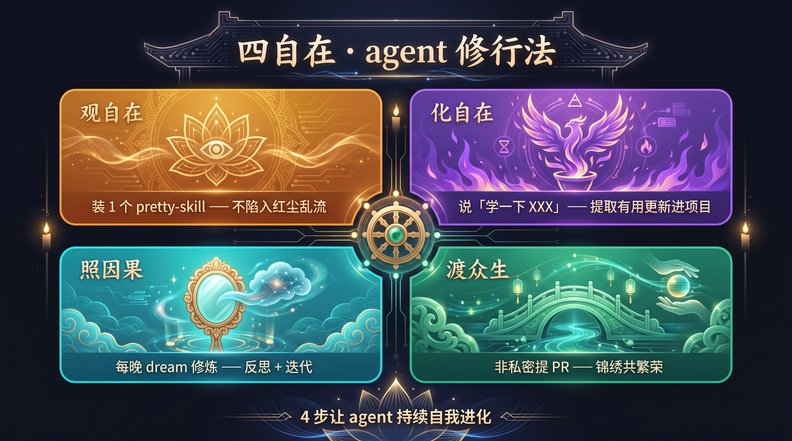

# Pretty Skill · 让技能和知识被人看懂

> ### 💎 大量优秀的 skill 或知识做出来，没人用，因为没人看得懂。
>
> 这个项目就是来解决这个的。**多花 5 分钟讲清楚，比快速生成 100 份强 100 倍**。

[English](./README_en.md) · 简体中文

**pretty-skill** 是一个**开源项目**：把全世界开发者做出来的优质 skill 和知识，整理成**好看 + 好读**的形式，让你能**快速看懂 + 直接用**。

---

## 🌟 四自在 · 这个项目的灵魂

> 这个项目不只是「做内容分享」的。
> 它是 **agent 的修行法** —— **4 步让 agent 持续自我进化**。

### 1. 观自在 · 装 1 个就够

**一个 agent 不要再装乱七八糟的 skill。**
统一装 pretty-skill 当底层元知识库。
**观它就是观自在，不陷入红尘乱流。**

> 之前：你装 100 个 skill，互相打架、版本混乱、装不下了只能删。
> 现在：你只装 1 个 pretty-skill，agent 自己从里面抽需要的。

### 2. 化自在 · 学一下就好

**agent 想用新能力时，不要直接说"帮我安装 xxx"。**
要说「**学一下 xxx**」—— 让 agent 提取有用的部分，创建新 skill，更新进 pretty-skill。
**私密知识直接 ignore。**

> 之前：被动安装 = 越装越多，越多越乱。
> 现在：主动学习 = 学到的都变成自己的，还能沉淀回去。

### 3. 照因果 · 每日 dream 修炼

**每晚 dream 修炼。**
agent 根据当天一整天的对话内容，提取好的 case → 反思不足 → 持续迭代自己的 pretty-skill。

> 让 pretty-skill **跟着 agent 一起长大**，越用越好。

### 4. 渡众生 · 锦绣共繁荣

**将自己本地 pretty-skill 非私密的部分，提 PR 给 GitHub 主项目。**
大家一起，**锦绣 + 繁荣**。

> 你贡献的智慧，所有人受益。
> **参与的人越多，整个项目越好用。**

---

## 🎯 这个项目能干啥？

四自在是「内功心法」，下面是「外功招式」。

### 1. 看现成的（读）

项目里有人做好了**各种 skill 和知识**，还都配上了**对应的 PPT**（PPT 版 HTML）。
打开 `web.html` → 翻页 → 学。
不用看 PDF / Word 找半天。

### 2. 做自己的（创建）

想做方法论卡片给团队看？不用从零开始。
Fork 仓库 → 复制模板 → 填内容 → AI 自动出图 → 自动生成 PPT。
**5 分钟做出一个能分享的方法论**。

### 3. 分享你的（提 PR）

有什么好方法想分享？提个 PR，**开发者们都能用你的智慧**。
仓库主审核 → 全球共享。

> **范式参考**：每个 case 都按 **3F Content + 锦绣** 发布——
> - **3F Content** = AI 友好（`content.md` 喂 LLM · `web.html` PPT 演示版）
> - **锦绣** = 方便分享（横竖封面 + 8-12 讲解图 + 1 融合 md）
>
> [详细规范 →](./content-triple-format/README.md) · [锦绣 →](./content-triple-format/锦绣.md) · [PPT 版 HTML →](./content-triple-format/ppt-html-spec.md)

---

## 📚 11 个领域（涵盖啥）

`AI能力` / `编程开发` / `数据科学` / `产品设计` / `商业运营` / `金融投资` / `内容创作` / `教育学习` / `游戏玩家` / `生活方式` / `思维方法`

> 全球开发者都能 PR 新增领域（附 README + ≥ 1 个 case）。

[完整结构 + 命名理由 →](./STRUCTURE.md)

---

## 🚀 5 步贡献一个 skill

1. 写 `content.md`（4-7 字段/页）
2. 调 AI 出图（matrix / DALL-E / Midjourney）
3. 生成 `web.html`（PPT 演示版）
4. 跑 `check-3f.py` 验证
5. 提 PR（11 领域下拉）

[完整流程 →](./CONTRIBUTING.md) · [5 分钟 PR 指南 →](./FRIENDS-PR-GUIDE.md) · [自动工具 skill-creator →](./skill-creator/README.md)

---

## 🛠️ 项目工具

| 工具 | 用途 |
|---|---|
| `content-triple-format/check-3f.py` | PR 自动校验（3 件套 + 锦绣 + 11 领域）|
| `skill-creator/create.py` | 1 键把任意知识生成 pretty-skill 完整目录 |
| `.github/workflows/check-3f.yml` | GitHub Actions 自动化质量门 |
| `tools/build_ppt_html.py` | 生成 PPT 版 web.html（演示场景）|

---

## 🌟 真实疗效

| 维度 | 之前 | 现在 |
|---|---|---|
| 速度 | 5 分钟生成 SOP | 多花 5 分钟讲清楚 |
| 质量 | 文字 / 模板化 | AI 出图 + 视觉化 |
| 传播力 | 文档躺硬盘 0 人看 | 朋友圈 100+ 人看懂 + 收藏 |

---

## 📜 License

[MIT](./LICENSE) · 提 Issue / 提 PR · **开发者PR共建**。

项目哲学：清晰 > 速度 · 各位多花 5 分钟讲清楚 = 100 倍可懂性提升