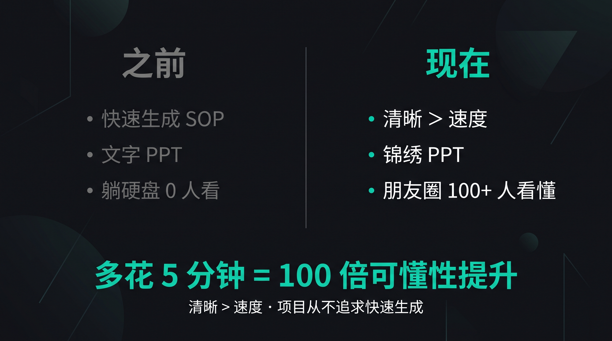
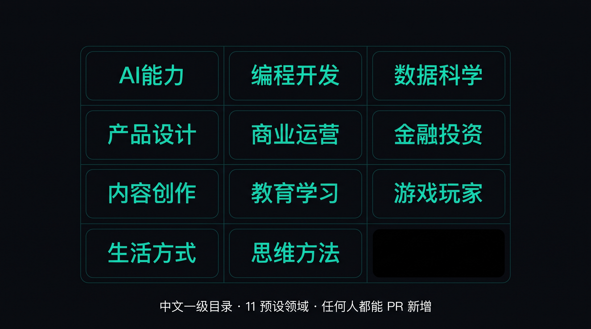

# Pretty Skill · 全球优质技能与知识集合

> ### 💎 大量优秀的 skill 或知识做出来，没人用，因为没人看得懂。
>
> 这个项目**从不追求快速生成 SOP**。各位多花几分钟，生成能讲解清楚你的 skill 或知识的图片、封面、pptx、html，**方便人看和学**，才是一直被忽视的重要东西。

[English](./README_en.md) · 简体中文

**pretty-skill** = 开源项目 · 集合全世界开发者与玩家贡献的优质技能 / 知识 · 按 **3F Content + 锦绣** 范式发布，让任何知识**被 AI 消化 + 被人看懂 + 被人传播**。

---

## 💎 项目哲学

> **清晰 > 速度 · 让人看得懂 > 快速生成**

之前的 AI 工具追求"自动化"和"快速生成"——但这恰恰是**优秀知识没人用的根因**。**多花 5 分钟讲清楚 = 100 倍可懂性提升**。

---

## 🎯 范式：3F Content + 锦绣

- **3F Content** = AI 友好（`content.md` 喂 LLM · `web.html` PPT 演示版）
- **锦绣** = 人易传播（2 封面 + 8-12 讲解图 + 1 融合 md）

[详细规范 →](./content-triple-format/README.md) · [锦绣 →](./content-triple-format/锦绣.md) · [PPT 版 HTML →](./content-triple-format/ppt-html-spec.md)

---

## 📚 11 领域（中文一级目录 · 全球共建）

`AI能力` / `编程开发` / `数据科学` / `产品设计` / `商业运营` / `金融投资` / `内容创作` / `教育学习` / `游戏玩家` / `生活方式` / `思维方法`

> 全球开发者都能 PR 新增领域（附 README + ≥ 1 个 case）。

[完整结构 + 命名理由 →](./STRUCTURE.md)

---

## 🚀 5 步贡献一个 skill

1. 写 `content.md`（4-7 字段/页）
2. 调 AI 出图（matrix / DALL-E / Midjourney）
3. 生成 `web.html`（PPT 演示版）
4. 跑 `check-3f.py` 验证
5. 提 PR（11 领域下拉）

[完整流程 →](./CONTRIBUTING.md) · [5 分钟 PR 指南 →](./FRIENDS-PR-GUIDE.md) · [自动工具 skill-creator →](./skill-creator/README.md)

---

## 🛠️ 项目工具

| 工具 | 用途 |
|---|---|
| `content-triple-format/check-3f.py` | PR 自动校验（3 件套 + 锦绣 + 11 领域）|
| `skill-creator/create.py` | 1 键把任意知识生成 pretty-skill 完整目录 |
| `.github/workflows/check-3f.yml` | GitHub Actions 自动化质量门 |
| `tools/build_ppt_html.py` | 生成 PPT 版 web.html（演示场景）|

---

## 🌟 真实疗效

| 维度 | 之前 | 现在 |
|---|---|---|
| 速度 | 5 分钟生成 SOP | 多花 5 分钟讲清楚 |
| 质量 | 文字 / 模板化 | AI 出图 + 视觉化 |
| 传播力 | 文档躺硬盘 0 人看 | 朋友圈 100+ 人看懂 + 收藏 |

---

## 📜 License

[MIT](./LICENSE) · 提 Issue / 提 PR · 全球开发者共建

项目哲学：清晰 > 速度 · 各位多花 5 分钟讲清楚 = 100 倍可懂性提升