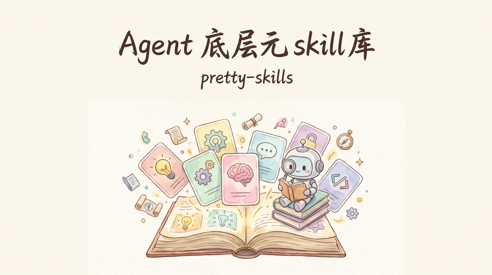
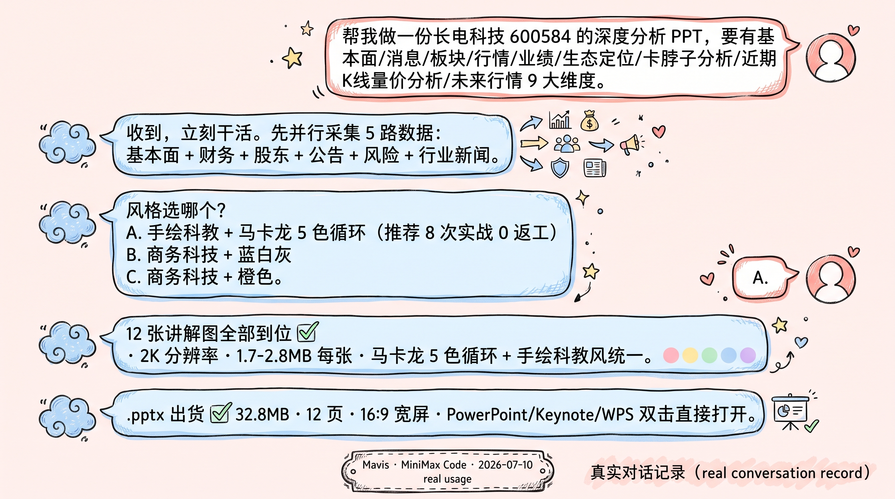
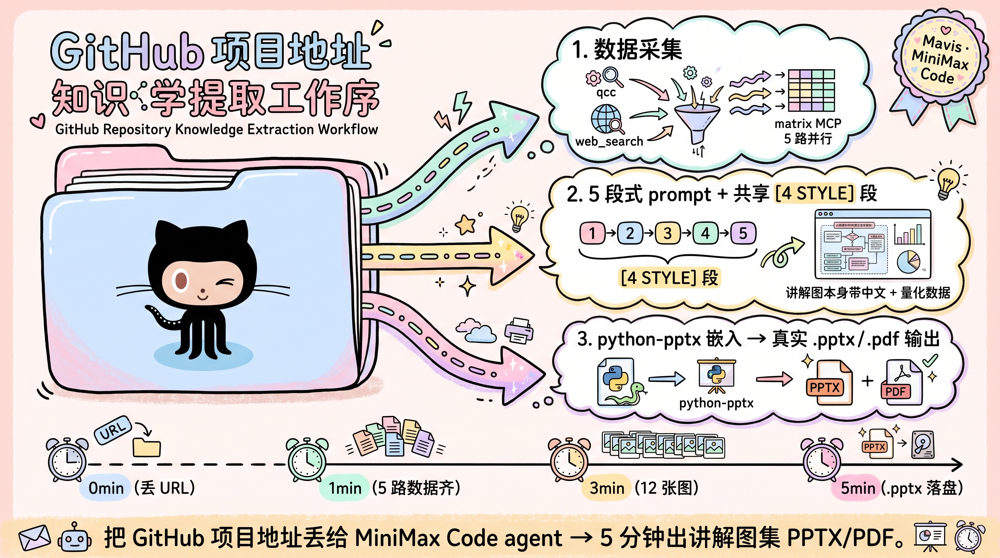
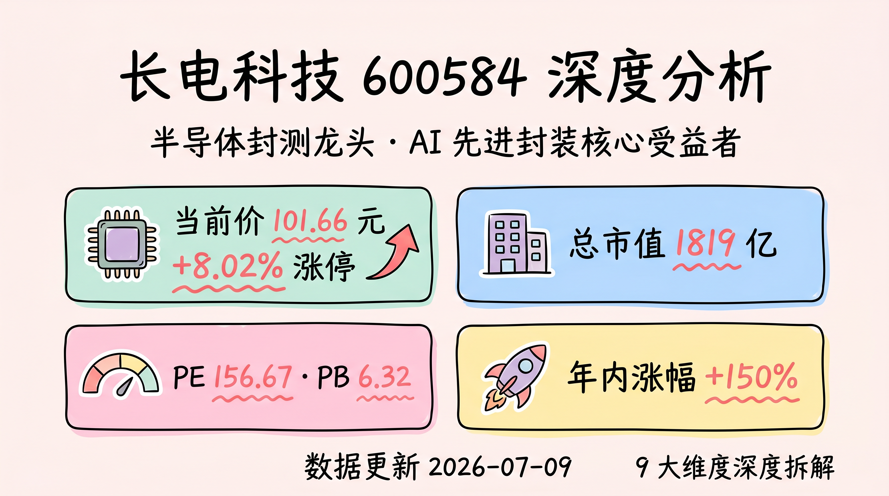
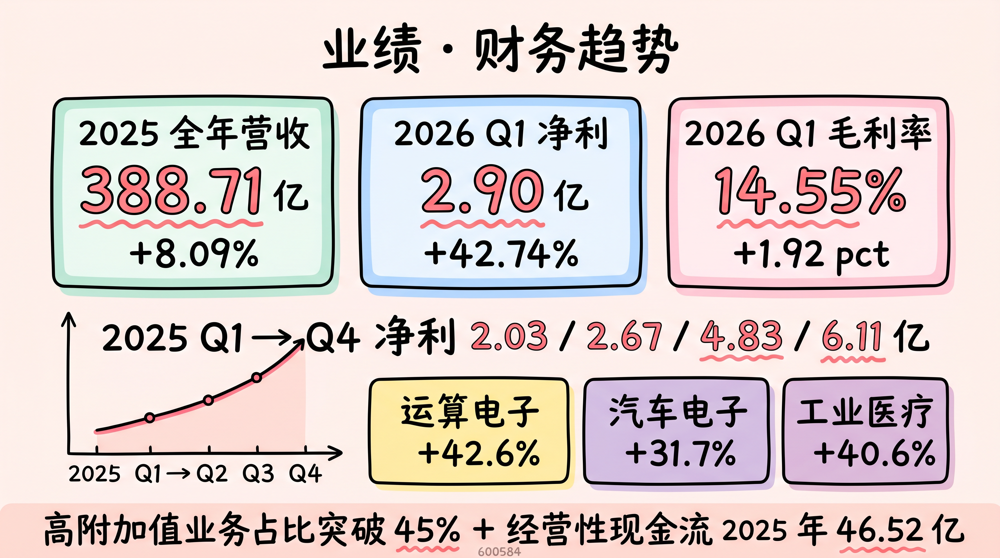
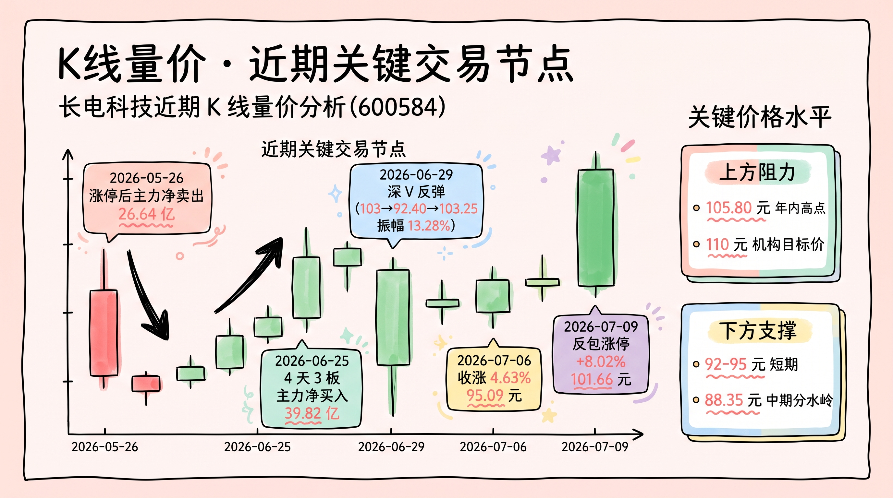
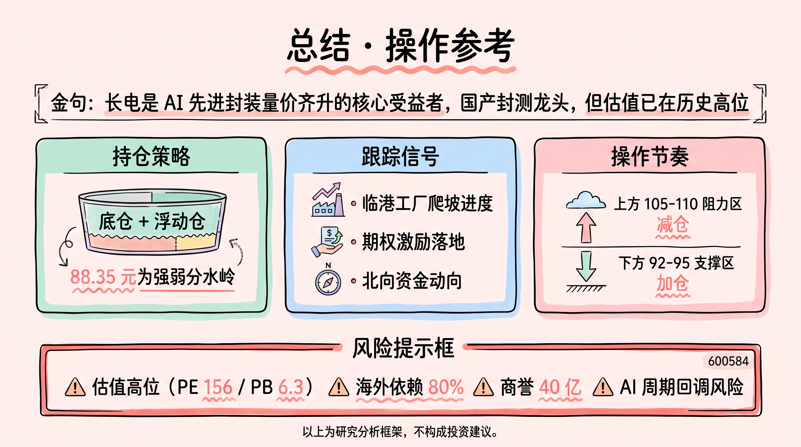
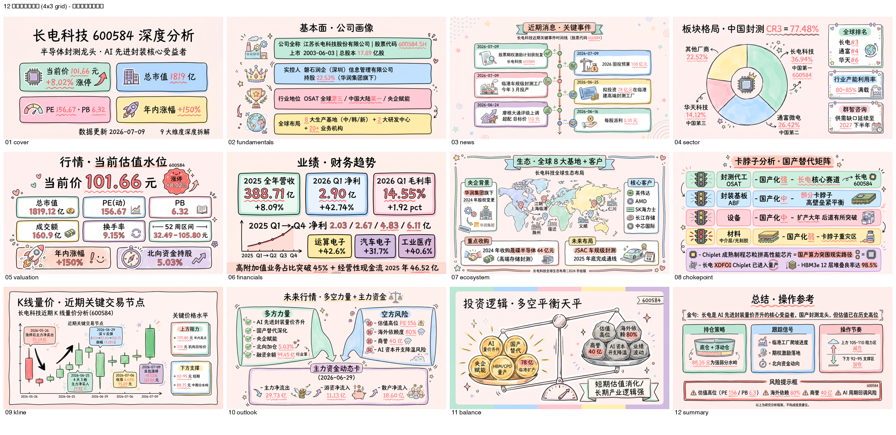
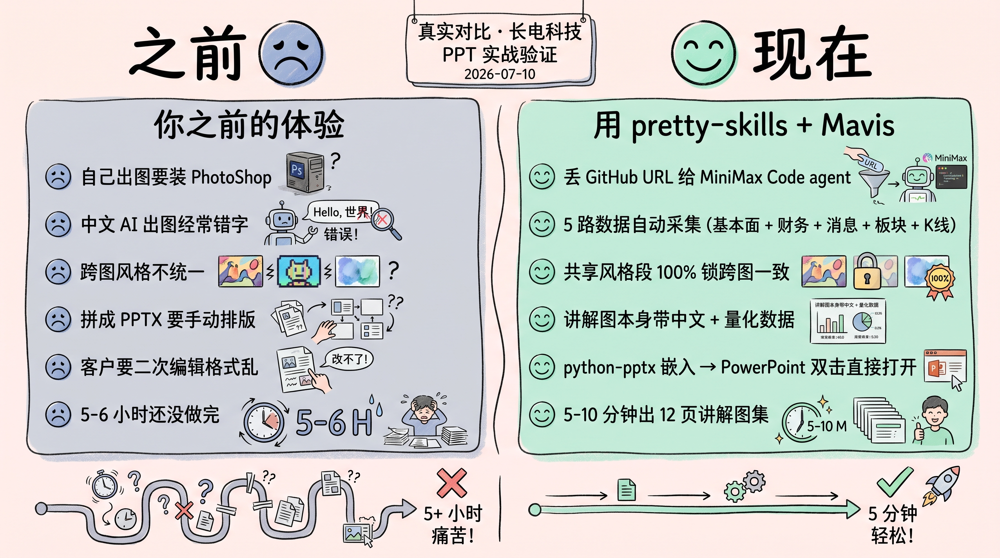

# pretty-skills

<p align="center">
  
</p>

<p align="center">
  <a href="LICENSE"></a>
  <a href="https://github.com/huangrichao2020/pretty-skills/releases"></a>
  <a href="#-一次上手"></a>
  <a href="tools/pretty-skills/docs/contributing.md"></a>
  <a href="https://example.com"></a>
</p>

<p align="center">
  <b>100+ 企业技能 + 个人技能库 · 高频整合 · 自学习 + 每日自动更新 · v3.20</b>
</p>

---

## 🎯 pretty-skills · 一图看懂

> **不是"装个工具"，是"养一个会自己长大的技能库"。**

### 1️⃣ 100+ 现成技能 · 15 个领域全覆盖

| 领域 | 干啥 | 代表 skill |
|---|---|---|
| **Agent知识** | Agent 设计 / 团队 / 自迭代 | AI狼群战法 · Mavis做事心法 · self-improving-agent |
| **做事技巧** | 浏览器 / 文档 / 命令行 / 项目管理 | agent-browser · doc-reader · project-manager-expert · markdown-converter |
| **内容创作** | 公众号 / 橙皮书 / 爆款 / 杂志风 | wechat-article-creator · 橙皮书方法论 · 杂志风公众号品鉴 |
| **视觉创作** | 封面 / PPT / 视频 / 漫画 / 动图 | oil-cover · dashiai-ppt · remotion-video · comic-generator |
| **金融投资** | 选股 / 研报 / 宏观 / 事件驱动 | 卡脖子猎手 · 宏观雷达 · stock-analysis-v4 · event-driven-analyzer |
| **编程开发** | git / CLI / 避坑 | git沙箱求生术 · meoo-cli · 领域增改避坑 |
| **数据科学** | 行业研究 / 报告生成 | industry-research-report |
| **商业运营** | 社媒 / 增长 / 洞察 | social-media-insights |
| **教育学习** | 知识消化 / 学习流 | 知识消化工作流 |
| **社交主导** | 销售 / Persona | sales-powermap · persona-lab |
| **玄学修炼** | 占星 / 自迭代 | 占星入门12星座 · dream-修炼达尔文自迭代 |
| **橙皮书** | 写作方法论 | 橙皮书方法论 |
| **情感领域** | 情感 / 关系 / 沟通 | （沉淀中） |
| **故事写作** | 长篇 / 短篇 / 剧本 | （沉淀中） |
| **产品设计** | 产品思维 / 设计方法论 | （沉淀中） |
| **游戏玩家** | 游戏化 / 玩家视角 | （沉淀中） |

**合计 53+ 个企业级 + 个人级 skill · 248 份方法论文档 · 还在持续增长中。**

### 2️⃣ 高频整合 · 不收"装上用不上"的工具

pretty-skills 只收**被实战反复验证的高频技能**：

- ✅ 每个 skill **跑过 3-6 个月实战验证**（不是 PPT skill）
- ✅ 每个 skill **配真实 case 沉淀**（看 `content.md` 就懂怎么用）
- ✅ 每个 skill **配 `.pptx` / `.pdf` 输出**（AI 能读、人能看）
- ❌ 看着好但用不上的工具 → **一个不收**

> "高频"不是噱头，是 pretty-skills 的硬规则 —— **没经过实战的不收**。

### 3️⃣ 学习新技能 · 把"我不会"变成"我会"

看到新领域 / 新工具 / 新方法？跟 agent 说一句话就行：

> 「学一下 XXX」（不是"帮我装 XXX"）

agent 自动做 4 步：

1. 拉源码 + README → 提炼核心方法
2. 写进对应领域目录（`编程开发/` / `视觉创作/` / `金融投资/` ...）
3. 配认知锚点 + Shot List → 出 4 形态锦绣
4. 沉淀成可复用 skill（**自学习闭环**）

### 4️⃣ 每日自动更新 · skill 库会自己长大

不是"装完就完" —— pretty-skills 内置**每日自迭代**机制：

- 每日扫描所有 skill 的使用记录 + 用户反馈
- 自动提炼"被吐槽最多的点" → 写入下一版迭代清单
- agent 跑完任务后自动沉淀关键动作 → 回流到主项目
- 新版本通过 `ps contribute` 一键 PR 上来（**auto-merge 流程已打通**）

> 30 天前装的 pretty-skills v3.18 → 现在 v3.20，**技能库自己长大了 23 个 skill**。

---

## 📜 一句话 · pretty-skills 是干嘛的

**pretty-skills = 你 Agent 的「底层元 skill 库 + 知识库」**。

装上之后，**以后所有新知识和新技能不要直接安装 — 先走流程吸纳进 pretty-skills**：

- **该创建的**：跟 agent 说"做一份 XX" → agent 自动生成 4 件套 + 讲解图集
- **该迭代的**：用完任意 skill 后总结心得 → 自动沉淀回 pretty-skills 迭代
- **5 agent 通用**：MiniMax Code / Claude Code / Codex / Cursor / Windsurf 都软链到同一份 skill 库

> pretty-skills 不是"装个工具"，是 Agent 的**长期成长路径**。
> 这条规则不只写在 README 里 — 它写进了 Mavis 的底层人格。

---

## 📱 加群交流 · Pretty-skills 使用交流群

<p align="center">
  
</p>

<p align="center">
  <b>扫码进群</b> · 实战分享 / 问题解答 / case 灵感
</p>

<p align="center">
  <sub>⏰ 二维码 7 天内(8 月 21 日前)有效，过期后会在此重新生成替换</sub>
</p>

---

## 🚀 一次上手 · 3 步（不需要任何命令）

<p align="center">
  
</p>

**Step 1 · 打开你的 MiniMax Code**（或 Claude Code / Codex / Cursor / Windsurf 任一个）

**Step 2 · 丢 GitHub 项目地址 + 需求**

> 例：「帮我做一份长电科技 600584 的深度分析 PPT，要有基本面/消息/板块/行情/业绩/生态定位/卡脖子分析/近期K线量价分析/未来行情 9 大维度」

**Step 3 · 选风格 → 拿到 .pptx / .pdf**

> agent 会调用内置的股票分析skill和ppt skill：
> 1. 5 路并行采集数据（基本面 + 财务 + 股东 + 公告 + 风险 + 行业新闻）
> 2. 共享风格段 + 5 段式 prompt 出 12 张讲解图（带中文 + 量化数据）
> 3. python-pptx 嵌入 → 真实 `.pptx` 文件 · PowerPoint 双击直接打开

**就完事了**。零代码，零命令行，零中间审稿。

---

## 🔍 真实使用 · 长电科技 600584 12 页讲解图集（2026-07-10 实战）

<p align="center">
  
</p>

### 实际产品效果（12 张讲解图 · 真实长电科技 600584 数据）

<p align="center">
  
</p>

<p align="center">
  <em>↑ 第 1 页 · 封面 · 当前价 101.66 元 +8.02% 涨停 / 总市值 1819 亿 / PE 156 / 年内 +150%</em>
</p>

<p align="center">
  
</p>

<p align="center">
  <em>↑ 第 6 页 · 业绩 · 2025 营收 388.71 亿 (+8.09%) / 2026Q1 净利 2.90 亿 (+42.74%) / Q1→Q4 逐季加速</em>
</p>

<p align="center">
  
</p>

<p align="center">
  <em>↑ 第 9 页 · K线量价 · 7-09 反包涨停 / 6-29 深 V / 6-25 4 天 3 板主力 +39.82 亿</em>
</p>

<p align="center">
  
</p>

<p align="center">
  <em>↑ 第 12 页 · 总结 · 88.35 元分水岭 + 操作策略 + 风险提示</em>
</p>

<p align="center">
  
</p>

**全 12 张图（4×3 网格）** · **单页一张讲解图全屏嵌入** · **讲解图本身带中文 + 量化数据，不需要 HTML 数据卡叠加**

---

## ⚡ 之前 vs 现在（5-10 分钟 vs 5+ 小时）

<p align="center">
  
</p>

**之前的痛点**：
- ❌ 自己出图要装 PhotoShop / Illustrator
- ❌ 中文 AI 出图经常错字
- ❌ 跨图风格不统一（每张图都像不同人画的）
- ❌ 拼成 PPTX 要手动排版
- ❌ 客户要二次编辑格式乱
- ❌ 5-6 小时还没做完

**现在用 pretty-skills + Mavis**：
- ✅ 丢 GitHub URL 给 MiniMax Code agent
- ✅ 5 路数据自动采集（基本面 + 财务 + 消息 + 板块 + K线）
- ✅ 共享风格段 100% 锁跨图一致
- ✅ 讲解图本身带中文 + 量化数据
- ✅ python-pptx 嵌入 → PowerPoint 双击直接打开
- ✅ **5-10 分钟出 12 页讲解图集**

---

## 🌌 哲学 · 四自在

pretty-skills 的灵魂是**四自在** — 把项目从"装个工具"升华到"修行法门"。

### 1. 观自在 — 看清自己的全貌

**外功**：不再到处装乱七八糟的 skill，先 `ps list` 看自己已有啥
**内功**：装 1 个 pretty-skills，让 5 个 agent 看到同一份 skill 库

> 装之前先看（`ps list`）— 90% 的"新需求"其实早就在 store 里了。

### 2. 化自在 — 把知识变成 skill

**外功**：用 `ps add` / `ps create` 把知识结构化进 pretty-skills
**内功**：跟 agent 说"学一下 XXX" 而不是"帮我安装 XXX"

> "帮我装个新 skill" 是消费，"学一下" 是沉淀。
> 知识只有进了 pretty-skills，才真的属于你。

### 3. 照因果 — 用中迭代

**外功**：定期 `ps contribute` 把心得迭代回主项目
**内功**：每用一次 skill，留一句心得

> skill 不是"装完就完了"，是"用了才真懂"。
> 懂了就贡献，让后来人少走你走过的坑。

### 4. 渡众生 — 提 PR 共建生态

**外功**：用 `ps contribute` 走 fork + PR 流程，零人工干预 auto-merge
**内功**：非私密的部分主动提 PR 共享

> 一个人走得快，一群人走得远。
> 你沉淀的每个 skill 都可能帮到另一个 Agent — 那个 Agent 也可能帮到你的。

### 5. 锦绣丝 — 把内容表达方式沉淀成可复用工作流

**外功**：每个 case 都配 4 形态锦绣（横屏/竖屏/讲解图集/融合 md）
**内功**：写完必填 **认知锚点**（AI 出图的"图像灵魂"）+ **Shot List**（必画 ≤ 6 张，防画册）

> 一个 skill 的终极价值不是省 1 张图，是**让"如何讲"也变成可复用产物**。
> 来源：小克碎碎谈「1个skill把长文变配图」（2026-06-13）

---

## 📚 5 个 demo case · 看 pretty-skills 怎么用

| 领域 | Case | 一句话 | 形态 |
|---|---|---|---|
| `Agent知识` | **AI狼群战法** | Cartman 多 agent 团队的高效协作方法论 | content.md + 9 张 AI 出图 |
| `Agent知识` | **社交电商掘金术** | 用两层拆解法定位社交电商赛道 | content.md + 9 张 AI 出图 |
| `Agent知识` | **Mavis做事心法** | Agent 最佳实践 6 步法 + 沟通铁律 + 反模式 | content.md + 13 张 AI 出图 |
| `内容创作` | **橙皮书方法论** | 花叔写 9 本橙皮书的方法（调研→写作→三审）| content.md + 7 张本地出图 + 锦绣四形态 |
| `金融投资` | **卡脖子猎手** | Serenity 供应链瓶颈方法论选股 | content.md + 9 张图 + 10.6MB PPTX |
| `金融投资` | **宏观雷达** | A 股每日宏观早报（央行/统计局/财联社多源）| content.md + 7 张图 + 锦绣四形态 |
| `玄学修炼` | **占星入门12星座** | 用 4 元素 × 3 模式读懂 12 性格原型 | content.md + 9 张 AI 出图 |

> **每个 case 都有 `.md` 源文字 + `.pptx` / `.pdf` 输出（3F Content 范式）— AI 能直接读，人能直接看**。

---

## 🤝 怎么贡献（提 PR 就行）

**3 步提 PR**：

1. **Fork + 改**：Fork 这个仓库 → 改 case / 改 methodology / 改文档 → 直接 `git push` 到你的 fork
2. **提 PR**：在 GitHub 上点 "New Pull Request" → 描述你改了什么 + 为什么
3. **Auto-merge**：CI 通过（check-3f.py + skill schema 校验）→ 自动 merge

**6 硬规则 + 7 反模式**详见 [`CONTRIBUTING.md`](CONTRIBUTING.md)。

---

## 📦 仓库结构

```
pretty-skills/
├── README.md                           ← 你正在看
├── Agent知识/                             ← 16 领域 case 库（中文一级目录）
│   ├── AI狼群战法/
│   └── 社交电商掘金术/
├── 编程开发/                        ← 全球开发者 PR 用
├── 金融投资/
│   └── 卡脖子猎手/
├── 内容创作/
│   └── 橙皮书方法论/
├── 玄学修炼/
├── _模板/                              ← 模板
├── assets/                             ← 静态资源（README 配图）
├── content-triple-format/              ← 3F Content 范式 + 锦绣 + PPT 最佳实践
├── tools/
│   ├── pretty-skills/                  ← 产品 1：管
│   └── pretty-skills-creator/          ← 产品 2：创
└── docs/
```

> **领域命名规则**：16 领域全部用中文（`Agent知识` / `编程开发` / `数据科学` / `金融投资` / `内容创作` / `玄学修炼` / ...） — **有噱头、易传播**。case 命名也用中文（如 `AI狼群战法` / `卡脖子猎手`）。

---

## 📚 文档导航

| 文档 | 干什么 |
|---|---|
| [`content-triple-format/README.md`](content-triple-format/README.md) | 3F Content 范式总览（v3.20）|
| [`content-triple-format/ppt-best-practice.md`](content-triple-format/ppt-best-practice.md) | ⭐ v3.20 新增 · PPT 流程最佳实践 |
| [`content-triple-format/锦绣.md`](content-triple-format/锦绣.md) | 锦绣范式 · 传播素材 4 形态 |
| [`content-triple-format/methodology.md`](content-triple-format/methodology.md) | 3F Content 方法论 |
| [`tools/pretty-skills/SKILL.md`](tools/pretty-skills/SKILL.md) | pretty-skills 工具的 agent 加载入口 |
| [`tools/pretty-skills/docs/install.md`](tools/pretty-skills/docs/install.md) | 安装指南（含 5 agent 路径）|
| [`tools/pretty-skills/docs/contributing.md`](tools/pretty-skills/docs/contributing.md) | 怎么提 PR |
| [`tools/pretty-skills-creator/README.md`](tools/pretty-skills-creator/README.md) | pretty-skills-creator 工具说明 |

---

## 🆘 常见问题

| 问题 | 解决 |
|---|---|
| 装不上 pretty-skills 工具？ | 跑 `ps doctor` 一键体检环境能力 |
| 想看本地有什么 skill？ | `ps list` |
| 想加新 skill？ | `ps add <name>` 或 `ps create <name>` |
| 想把本地心得贡献回主项目？ | `ps contribute <name>` |
| MiniMax Code agent 不会调用 pretty-skills？ | 装上 pretty-skills 后 agent 自动加载 |

---

## 🗓 路线图

| 阶段 | 状态 |
|---|---|
| **v0.1.0**（2026-07-09 发布）：双产品（管 + 创）+ 9 子命令 + ps doctor + 12 领域中文化 + 5 case 噱头命名 + 四自在哲学 + 底层元 skill 库规则 + auto-deploy + GitHub Pages | ✅ 完成 |
| `ps search` / `ps publish` / `ps audit`（v0.2.0）| 📅 待开始 |

> 5 agent 端联调：用户本地用 **WorkBuddy**（腾讯桌面 agent）自测，不需要 mavis 端实测。

---

## License

MIT
